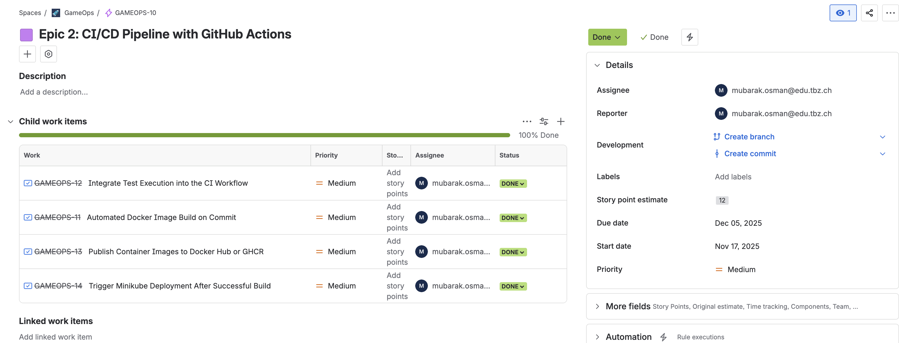
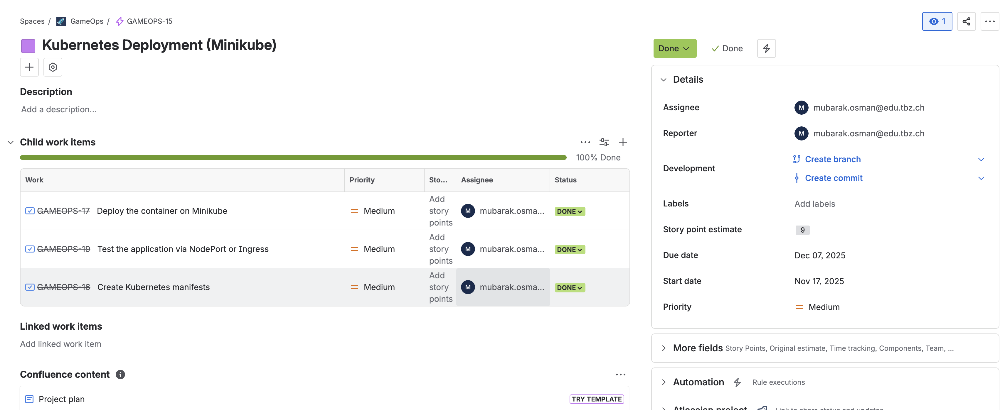

# GameOps
---
## 📉 Projektbeschreibung

Das Tic-Tac-Toe-Spiel wird aktuell lokal entwickelt und läuft nur für einen
Spieler.
Es fehlt die Möglichkeit, die Anwendung so zu gestalten, dass mehrere
Nutzer gleichzeitig spielen können.
Durch die Entwicklung einer skalierbaren Version in Kombination mit
Kubernetes, Containerisierung und CI/CD-Pipelines soll das Spiel
automatisiert bereitgestellt und horizontal skaliert werden, sodass viele
Spieler gleichzeitig eine stabile Spielerfahrung erhalten.

---

## 🎯 Ziele

* **Entwicklung und Containerisierung einer skalierbaren Tic-Tac-Toe-Webanwendung:**

  * Die Anwendung wird mit **HTML, CSS und JavaScript** entwickelt und mithilfe von **Docker bzw. Podman** containerisiert, um eine flexible, portable und reproduzierbare Bereitstellung zu ermöglichen.

* **Aufbau einer CI/CD-Pipeline mit GitHub Actions:**

  * Durch den Einsatz einer automatisierten Pipeline werden **Build-, Test- und Deployment-Prozesse** standardisiert und effizient gestaltet, wodurch manuelle Eingriffe minimiert und die Zuverlässigkeit erhöht werden.

* **Automatisierte Bereitstellung auf lokalem Kubernetes (Minikube):**

  * Die Bereitstellung der Anwendung erfolgt automatisiert über **Kubernetes-Manifeste** auf einer lokalen **Minikube-Umgebung**, um produktionsähnliche Bedingungen für Tests und Entwicklung zu schaffen.

* **Überwachung und Verwaltung mit Lens:**

  * Mithilfe von **Lens** wird die laufende Kubernetes-Umgebung grafisch überwacht, wodurch **Ressourcennutzung, Pod-Zustände und Logs** transparent und einfach nachvollziehbar sind.

* **Sicherstellung einer stabilen Mehrspielernutzung:**

  * Durch die **Skalierbarkeit der Container** und das **Ressourcenmanagement in Kubernetes** wird gewährleistet, dass mehrere Benutzer gleichzeitig spielen können, ohne dass die Performance oder Stabilität der Anwendung beeinträchtigt wird.
---

## 🤖💡💻 Verwendete Technologien

Ich verwende GitHub Actions für CI/CD, um Container mit Podman zu bauen, diese auf Docker Hub zu pushen und anschliessend mithilfe eines self-hosted Runners lokal auf Minikube bereitzustellen. Zur Überwachung des Clusters nutze ich Lens.

### GitHub & CI/CD
Alle Builds und Deployments werden über GitHub Actions automatisiert.
Das Repository enthält sowohl den Frontend-Code als auch die Kubernetes-Manifeste.

```
actions/checkout@v4
azure/setup-kubectl@v3
Runner-Version: 2.329.0
```

### Podman

Podman wird verwendet, um Container-Images zu erstellen und in Docker Hub zu pushen.

```
podman --version
podman version 5.4.0
```

### Docker Hub

Docker Hub dient als Container-Registry, um die erstellten Images zu speichern und für den Minikube-Cluster bereitzustellen.

```
Image: docker.io/<username>/gameops:latest
```

### Minikube & Kubernetes

Minikube wird lokal auf macOS M1 ausgeführt, um ein Kubernetes-Cluster bereitzustellen.
Über **kubectl** werden Deployments und Services angewendet.

```
minikube version
minikube version: v1.37.0
commit: 65318f4cfff9c12cc87ec9eb8f4cdd57b25047f3
```
```
kubectl version --client
Client Version: v1.34.1
Kustomize Version: v5.7.1
```

### Self-Hosted Runner

Der Runner läuft lokal auf macOS ARM64 und führt die Deployments auf Minikube aus.

```
macOS Sonoma 14.0
Architecture: arm64
```

### Lens

Lens wird verwendet, um das Minikube-Cluster visuell zu überwachen (Pods, Deployments, Logs und Services).

```
Lens Desktop 2024.x
```

### Frontend

Das Tic-Tac-Toe-Spiel besteht aus statischen Webdateien, die im Container bereitgestellt werden:

```
index.html
tic-tac-toe.js
tic-tac-toe.css
```

---

## 🛠️ Vorgaben, Methoden und Werkzeuge

### Agile, Kanban
Ich werde **Kanban** verwenden, um alle Aufgaben zu visualisieren und den Status jeder Aufgabe zu verfolgen. Der Status wird dabei in die folgenden Kategorien unterteilt:
- **Noch offen**: Aufgaben, die noch erledigt werden müssen.
- **In Bearbeitung**: Aufgaben, an denen gerade gearbeitet wird.
- **Review**: Aufgaben, die fertiggestellt wurden und überprüft werden müssen. 
- **Erledigt**: Aufgaben, die abgeschlossen sind.

Kanban hilft dabei, die Arbeit transparent und effizient zu organisieren und den Fortschritt kontinuierlich zu überwachen.

---
## 🧱 Architekturübersicht


---
## 🧭 Systemabgrenzung (SEUSAG)
---
## Verzeichnisstruktur

```
📁 GameOps/
├── .github/
│   └── workflows/
│       └── ci‑cd.yml  
├── images/ 
├── k8s/
│   ├── deployment.yaml  
│   └── service.yaml  
├── scripts/
│   └── predeploy‑setup.sh  
├── src/
│   ├── assets/
│   │   ├── css/
│   │   │   └── tic‑tac‑toe.css  
│   │   ├── js/
│   │   │   └── tic‑tac‑toe.js  
│   └── index.html  
├── Containerfile  
└── README.md  
```
---
## 🧑‍💻 Implementierung
---
### Build the Game Frontend UI

Der folgende Abschnitt beschreibt den Aufbau des Frontends für das Tic-Tac-Toe-Spiel.  
Die Benutzeroberfläche besteht aus drei Kernbereichen:

- **HTML** – Struktur & UI-Elemente  
- **CSS** – Layout & Styling  
- **JavaScript** – Spiellogik & Interaktionen  

---
#### HTML – Struktur der Benutzeroberfläche

Die Grundstruktur des Spiels – Spielfeld, Container und UI-Elemente – ist in der index.html definiert.

 **📄 Datei ansehen:**  [➤ index.html öffnen](/src/assets/index.html)

---

#### CSS – Styling & Layout
Das Layout, Farben, Animationen und Responsive Design werden in der CSS-Datei umgesetzt.
Sie definiert unter anderem das Spielfeld, Hover-Effekte und Spieler-Markierungen.

**🎨 CSS-Datei ansehen:**  [➤ tic-tac-toe.css öffnen](/src/assets/css/tic-tac-toe.css)

---

#### JavaScript – Spiellogik & Interaktionen

Die komplette Spielmechanik (Spielzüge, Gewinnlogik, Neustart-Funktion etc.) wird über die JavaScript-Datei gesteuert.
Sie verbindet die UI mit der Spiel-Engine.
**⚙️ JavaScript-Datei ansehen:**  [➤ tic-tac-toe.js öffnen](/src/assets/js/tic-tac-toe.js)

---
### 🕹️ Tic-Tac-Toe Frontend lokal mit Podman ausführen

Dieses Projekt stellt das **Tic-Tac-Toe-Frontend** über einen leichtgewichtigen **Nginx-Container** bereit.  
Mit **Podman** kannst du die Anwendung **lokal, isoliert und portabel** ausführen, ohne dass zusätzliche Webserver oder Entwicklungswerkzeuge auf deinem System installiert sein müssen.

Dieses Setup ist ideal für:

- Schnelles Testen und Entwickeln der Anwendung  
- Präsentationen oder Demos  
- Konsistentes Verhalten auf verschiedenen Rechnern
---
####  📦 Containerfile (Nginx-basierter Webserver)

Das Containerfile erstellt ein schlankes Image auf Basis von `nginx:alpine`.  
Es entfernt die Standard-Nginx-HTML-Dateien und kopiert die eigenen statischen Dateien (HTML, CSS, JS) hinein:

```dockerfile
# Use a lightweight Nginx image
FROM nginx:alpine

# Remove the default Nginx HTML files
RUN rm -rf /usr/share/nginx/html/*

# Copy your static files into Nginx
COPY src/assets/index.html /usr/share/nginx/html/
COPY src/assets/css/tic-tac-toe.css /usr/share/nginx/html/
COPY src/assets/js/tic-tac-toe.js /usr/share/nginx/html/ 

# Expose port 80
EXPOSE 80

# Start Nginx
CMD ["nginx", "-g", "daemon off;"]
```

##### 🔹 Erklärung der einzelnen Schritte

FROM nginx:alpine – Nutzt ein leichtes, stabiles Nginx-Image als Basis.

RUN rm -rf /usr/share/nginx/html/ – Entfernt die Standard-Nginx-Seite.

COPY … – Kopiert HTML, CSS und JS ins Nginx-Webverzeichnis.

EXPOSE 80 – Öffnet den Standard-HTTP-Port im Container.

CMD ["nginx", "-g", "daemon off;"] – Startet Nginx im Vordergrund, damit der Container aktiv bleibt.

---

##### 🛠️ Image bauen

Baue das lokale Image:

```
podman build -t gameops .
```
- Das Image heisst gameops
- Enthält alle Frontend-Dateien und einen Nginx-Webserver
---

##### ▶️ Container starten

Starte den Container und mappe den Container-Port 80 auf Host-Port 8080:

```
podman run -d -p 8080:80 --name gameops-ui gameops
```
- -d → Container läuft im Hintergrund

- -p 8080:80 → Host-Port 8080 auf Container-Port 80
- --name gameops-ui → Name des laufenden Containers

---
##### 🌐 Anwendung öffnen

Öffne deinen Browser: 

```
http://localhost:8080
```
Du solltest nun das Tic-Tac-Toe-Frontend sehen und direkt spielen können.


---
##### 📊 Containerstatus prüfen

Um zu prüfen, ob der Container läuft:

```
podman ps
```
| Container  | Status  | Port | Image   |
| ---------- | ------- | ---- | ------- |
| gameops-ui | RUNNING | 8080 | gameops |

###### In der Podman-App
- Öffne die Podman Desktop-App.  
- Unter **Container** siehst du alle laufenden Container, deren **Status**, **Name** und **zugeordnete Ports**.  
- So kannst du schnell prüfen, ob der Tic-Tac-Toe-Container aktiv ist.
  


---
### Build & Deploy GameOps

Dieser Abschnitt dokumentiert den **GitHub Actions Workflow**, der die GameOps Static Web-Anwendung automatisiert **baut, pusht und auf Minikube deployt**.  
Der Workflow sorgt dafür, dass neue Änderungen im `main`-Branch automatisch getestet und bereitgestellt werden.

---
#### 🛠️ Workflow Trigger

Der Workflow wird bei einem **Push auf den `main`-Branch** ausgelöst.  
Dateien, die keinen Deployment-Prozess betreffen, werden ignoriert:

- `README.md`  
- Alle Dateien im Verzeichnis `images/**`

```yaml
on:
  push:
    branches: [ main ]
    paths-ignore:
      - 'README.md'
      - 'images/**'
```
---
#### 🏗️ Build & Push Docker Image

**Zweck:** Container-Image erstellen und zu Docker Hub übertragen  
**Runner:** `ubuntu-latest` 

#####  Schritte

1. **Checkout des Codes**  
   Lädt den aktuellen Repository-Stand via `actions/checkout@v4`.
2. **Podman installieren**  
   Installiert Podman auf dem Runner, um Container zu bauen.
3. **Image bauen**  
   Das Image wird mit folgendem Tag erstellt:
4. **Login zu Docker Hub**  
Authentifizierung über GitHub Secrets (`DOCKERHUB_USERNAME` & `DOCKERHUB_TOKEN`).
5. **Image pushen**  
Überträgt das gebaute Image in Docker Hub.

```yaml
jobs:
build-and-push:
 runs-on: ubuntu-latest
 steps:
   - name: Checkout code
     uses: actions/checkout@v4
   - name: Install Podman
     run: |
       sudo apt-get update
       sudo apt-get install -y podman
   - name: Build Podman image
     run: |
       podman build -t docker.io/${{ secrets.DOCKERHUB_USERNAME }}/gameops:latest .
   - name: Login to Docker Hub
     run: echo "${{ secrets.DOCKERHUB_TOKEN }}" | podman login -u "${{ secrets.DOCKERHUB_USERNAME }}" --password-stdin docker.io
   - name: Push Podman image
     run: podman push docker.io/${{ secrets.DOCKERHUB_USERNAME }}/gameops:latest
  ```

---
#### 🏗️ Deploy to Minikube

**Zweck:** Container-Image vom Docker Hub ziehen und auf Minikube deployen  
**Runner:** self-hosted (lokal)  
**Abhängigkeit:** Läuft nur nach erfolgreichem Build & Push  

##### Schritte

1. **Checkout des Codes**  
   Lädt den aktuellen Repository-Stand.

2. **Pre-deployment Setup**  
   Führt das Skript `scripts/predeploy-setup.sh` aus.
```yaml
#!/usr/bin/env bash
set -e

mv ~/.kube/config ~/.kube/config.backup || true
minikube start --driver=podman
(cd /Users/mosman02/actions-runner && ./run.sh) &
``` 
  
   - Lokale Minikube-Umgebung für Tests bereitstellen.
   - Self-Hosted Runner vor Deployment verfügbar machen.
   - Bestehende kubeconfig schützen.
   - ***Weitere Infos:***  
👉 [Add Self-Hosted Runners – GitHub Docs](https://docs.github.com/en/actions/how-tos/manage-runners/self-hosted-runners/add-runners)


3. **kubectl einrichten**  
   Nutzt `azure/setup-kubectl@v3` für die aktuelle Version.

4. **Lokale kubeconfig verwenden**  
   Zugriff auf Minikube über `~/.kube/config`.

5. **Image in Minikube ziehen**  
```
run: minikube image pull docker.io/${{ secrets.DOCKERHUB_USERNAME }}/gameops:latest
```
6. **Kubernetes Manifeste anwenden**  

  ```yaml 
     kubectl apply -f k8s/deployment.yaml --validate=false
     kubectl apply -f k8s/service.yaml --validate=false
  ```

```yaml
deploy-to-minikube:
runs-on: self-hosted
needs: build-and-push
steps:
 - name: Checkout code
   uses: actions/checkout@v4
 - name: Run pre-deployment setup
   run: bash ./scripts/predeploy-setup.sh
 - name: Set up kubectl
   uses: azure/setup-kubectl@v3
   with:
     version: 'latest'
 - name: Use local kubeconfig
   run: echo "Using local kubeconfig at $HOME/.kube/config"
 - name: Pull Docker image into Minikube
   run: minikube image pull docker.io/${{ secrets.DOCKERHUB_USERNAME }}/gameops:latest
 - name: Apply Kubernetes manifests
   run: |
     kubectl apply -f k8s/deployment.yaml --validate=false
     kubectl apply -f k8s/service.yaml --validate=false
```

##### 🔹 Vorteile

- Automatisierung: Jeder Push auf main löst Build & Deployment aus.

- Sicherheit: Docker Hub Credentials werden über GitHub Secrets geschützt.

- Flexibilität: Lokales Testen auf Minikube möglich.

- Transparenz: CI/CD-Logs zeigen Status von Build, Push und Deployment.

---
### 📦 Kubernetes Deployment & Service Dokumentation

Dieser Abschnitt beschreibt die Kubernetes-Manifeste, die verwendet werden, um die **GameOps Webanwendung** zu deployen und über einen **NodePort-Service** erreichbar zu machen.

---
#### 🏗️ Deployment (GameOps)

Das Deployment stellt sicher, dass immer zwei Pods laufen und die Anwendung stabil bereitgestellt wird.

[➤ deployment.yaml öffnen](k8s/deployment.yaml)


```yaml
apiVersion: apps/v1
kind: Deployment
metadata:
  name: gameops
  labels:
    app: gameops
spec:
  replicas: 2
  selector:
    matchLabels:
      app: gameops
  template:
    metadata:
      labels:
        app: gameops
    spec:
      containers:
        - name: gameops
          image: docker.io/3ubarak/gameops:latest
          imagePullPolicy: Always
          ports:
            - containerPort: 80
```
##### 🔍 Erklärung

- replicas: 2 → Zwei Pods laufen gleichzeitig.
- imagePullPolicy: Always → Immer die neueste Image-Version laden.
- containerPort: 80 → Die Anwendung läuft im Container auf Port 80.
- Labels verbinden Deployment, Pods und Services miteinander.
---
#### 🌐 Service (NodePort)

[➤ service.yaml öffnen](k8s/service.yaml)


Der Service macht die App extern erreichbar – ideal für lokale Tests über Minikube.
```yaml
apiVersion: v1
kind: Service
metadata:
  name: gameops-service
spec:
  selector:
    app: gameops
  type: NodePort
  ports:
    - protocol: TCP
      port: 80
      targetPort: 80
      nodePort: 30007
```
##### 🔍 Erklärung

- type: NodePort → Öffnet einen Port am Minikube-Host.
- port / targetPort → Service-Port 80 → Container-Port 80.
- nodePort: 30007 → Browserzugriff über Minikube-IP.
---
#### 🌍 Anwendung öffnen

*Minikube-IP abrufen:*
```
minikube ip
```

*Browser öffnen:*
```
http://<minikube-ip>:30007
```

*Dienst im Standardbrowser öffnen:*

```
minikube service gameops-service
```
---

---

---

---
### Sprint 0
---
#### Zeitraum

<table>
  <thead>
    <tr>
      <th style="background-color:#f2f2f2;">Period</th>
      <th style="background-color:#f2f2f2;">Task</th>
    </tr>
  </thead>
  <tbody>
    <tr>
      <td style="color:#2E86C1;">01.11.2025 – 10.11.2025</td>
      <td style="color:#117A65;">Project Setup</td>
    </tr>
  </tbody>
</table>

---
#### Sprintziel

**Project Setup:**
Das Projekt initialisieren, die technische Basisstruktur festlegen und die notwendigen Repositories, Tools und Workflows zur Zusammenarbeit im Team aufsetzen.

---
#### 🛠️ User Stories – Project Setup
---


---
##### 🟣 User Story 1: GitHub-Repository einrichten <a name="user-story-1"></a>
**Als** Entwickler  
**möchte ich** ein GitHub-Repository erstellen,  
**damit** wir den Code versionieren und gemeinsam bearbeiten können.

**Akzeptanzkriterien:**
- Ein Repository mit dem Namen GameOps ist unter der richtigen Organisation oder dem richtigen Account vorhanden.
- Eine README.md, .gitignore und eine passende Lizenzdatei sind erstellt.
- Zugriffsrechte und Branch-Protection-Regeln sind korrekt konfiguriert.
---

##### 🟣 User Story 2: Verzeichnisstruktur organisieren <a name="user-story-2"></a>
**Als** Entwickler  
**möchte ich** Die Repository-Struktur wird klar und einheitlich aufgebaut, um die Wartbarkeit und Übersichtlichkeit zu gewährleisten.  
**damit** eine gemeinsame technische Grundlage besteht.

**Benötigte Verzeichnisse:**
- app/ – Applikationsquellcode
- deployment/ – Deployment-Skripte und -Konfigurationen
- .github/workflows/ – CI/CD-Workflows und Automatisierungen
- docs/ – Projektdokumentation

**Akzeptanzkriterien:**
- Die oben genannten Ordner sind im Repository vorhanden.

---

 ##### 🟣 User Story 3: Lokale Entwicklungs-Tools installieren und konfigurieren <a name="user-story-3"></a>

**Als** Entwickler  
**möchte ich** Entwicklung notwendigen Tools installieren
**damit** wir unsere Infrastruktur aufbauen können.

**Tools**

- **Docker** – Zum Containerisieren und lokalen Ausführen der Applikation

- **Minikube** – Zum Simulieren einer Kubernetes-Umgebung

- **Lens** – Zur Verwaltung und Visualisierung von Kubernetes-Ressourcen

**Akzeptanzkriterien:**
- Docker, Minikube und Lens sind lokal installiert und funktionsfähig.
- Die Grundfunktionen jedes Tools (z. B. Start eines Testcontainers oder lokalen Clusters) wurden erfolgreich überprüft.
---
#### Sprint Backlog


| Nr. | Bereich            | User Story                                           | Status   |
|-----|--------------------|------------------------------------------------------|----------|
| 1   | Project Setup      | [GitHub-Repository einrichten einrichten](#user-story-1)       | ✅ Done  |
| 2   | Project Setup      | [Verzeichnisstruktur organisieren definieren](#user-story-2)          | ✅ Done  |
| 3   | Project Setup      | [Lokale Entwicklungs-Tools installieren und konfigurieren](#user-story-3)                               | ✅ Done  |

---
#### 🏁 Sprint Review
---
##### ✅ Was wurde erreicht?
- Neues **GitHub-Repository `GameOps`** wurde erfolgreich erstellt und konfiguriert.  
- Klare **Projektstruktur** mit den Verzeichnissen `app/`, `deployment/`, `.github/workflows/` und `docs/` wurde angelegt.  
- **README.md**, `.gitignore` und Lizenzdatei wurden hinzugefügt.  
- **Docker**, **Minikube** und **Lens** wurden lokal installiert und erfolgreich getestet.  
- Grundlegende **CI/CD-Struktur** vorbereitet (Workflows-Ordner vorhanden).  
---
##### ⚠️ Herausforderungen
- Lokale Installation von **Minikube** benötigte zusätzliche Anpassungen an der Umgebung.  
- Erste **Repository-Zugriffsrechte** mussten nachträglich korrigiert werden.  
- Zeitplanung für das lokale Setup wurde leicht unterschätzt.  
---
##### 🎓 Lessons Learned
- Frühzeitige Planung der lokalen Entwicklungsumgebung spart viel Abstimmungsaufwand.  
- Zugriffs- und Berechtigungsstrukturen sollten vor dem Start klar definiert sein.  
- Gemeinsame Dokumentation im `docs/`-Ordner erleichtert zukünftige Einarbeitungen.  
---

#### 🔍 Sprint Retrospective
---
##### ✅ Was lief gut?
- Das **Repository** wurde sauber erstellt und ist klar strukturiert.  
- Die Teammitglieder konnten **Docker**, **Minikube** und **Lens** erfolgreich einrichten.  
- Zusammenarbeit im Team war effizient und gut koordiniert.  
- Dokumentation wurde parallel gepflegt.  
---
##### ⚠️ Was lief nicht gut?
- Die Installation von **Minikube** war auf einigen Geräten fehleranfällig.  
- Zugriffsrechte auf das GitHub-Repository mussten manuell nachjustiert werden.  
- Die Zeit für lokale Tests wurde etwas unterschätzt.  
---
##### 🚀 Verbesserungsmöglichkeiten
- Künftige lokale Setups sollten durch eine **standardisierte Installationsanleitung** unterstützt werden.  
- **Repository-Berechtigungen** direkt zu Sprintbeginn festlegen.  
- Einen **kurzen Testlauf der Tool-Installation** im Voraus einplanen, um mögliche Fehlerquellen früh zu erkennen.  
  
---
### Sprint 1
---
#### Zeitraum

<table>
  <thead>
    <tr>
      <th style="background-color:#f2f2f2;">Period</th>
      <th style="background-color:#f2f2f2;">Sprint</th>
    </tr>
  </thead>
  <tbody>
    <tr>
      <td style="color:#2E86C1;">10.11.2025 – 17.11.2025</td>
      <td style="color:#117A65;">Game Frontend Development and Containerization</td>
    </tr>
  </tbody>
</table>

---
#### Sprintziel
**Game Frontend Containerization:** Entwicklung und Containerisierung des Tic-Tac-Toe Frontends. Fokus liegt auf dem Aufbau einer klar strukturierten Projektverzeichnisstruktur, der Erstellung des Frontend-UI-Codes (HTML, CSS, JS), der Containerisierung mit Docker (Containerfile) sowie dem Testen des Containers lokal, um eine stabile Basis für zukünftiges Deployment auf Kubernetes zu schaffen.

---
#### 🖥️📦 User Stories - Game Frontend Development & Containerization
---


---

##### 🟣 **User Story 4: Game Frontend UI entwickeln** <a name="user-story-4"></a>  
**Als** Entwickler  
**möchte ich** die Benutzeroberfläche des Spiels entwickeln  
**damit** die Spieler eine funktionale und ansprechende UI zum Spielen haben.

**Akzeptanzkriterien:**  
- HTML, CSS und JS für das Tic-Tac-Toe-Frontend sind geschrieben.  
- Die UI kann lokal im Browser getestet werden und reagiert korrekt auf Spielerinteraktionen.  
- Grundlegende Layout- und Designrichtlinien sind umgesetzt.

---

##### 🟣 **User Story 5: Entwicklungsumgebung und Projektstruktur aufsetzen** <a name="user-story-5"></a>  
**Als** Entwickler  
**möchte ich** die Projektstruktur klar organisieren  
**damit** die Wartbarkeit und Erweiterbarkeit des Frontends gewährleistet ist.

**Benötigte Verzeichnisse:**  
- `.github/workflows/` – CI/CD-Workflows  
- `src/assets/` – HTML, CSS, JS  
- `images/` – Dokumentation bilder  
- `k8s/` – Kubernetes-Deployment- und Service-Dateien  
- `scripts/` – Hilfsskripte für Setup oder Deployment  
- `Containerfile` – Dockerfile für das Frontend  
- `README.md` – Projektdokumentation

**Akzeptanzkriterien:**  
- Ordnerstruktur ist erstellt und sauber dokumentiert.  
- Teammitglieder können die Dateien problemlos finden und erweitern.

---

##### 🟣 **User Story 6: Frontend mit Docker containerisieren** <a name="user-story-6"></a>  
**Als** Entwickler  
**möchte ich** das Frontend in einem Docker-Container laufen lassen  
**damit** wir es konsistent lokal und später in Kubernetes ausführen können.

**Dockerfile** (bereits geschrieben):

```
# Use a lightweight Nginx image
FROM nginx:alpine

# Remove the default Nginx HTML files
RUN rm -rf /usr/share/nginx/html/*

# Copy your static files into Nginx
COPY src/assets/index.html /usr/share/nginx/html/
COPY src/assets/css/tic-tac-toe.css /usr/share/nginx/html/
COPY src/assets/js/tic-tac-toe.js /usr/share/nginx/html/

# Expose port 80
EXPOSE 80

# Start Nginx
CMD ["nginx", "-g", "daemon off;"]
```
---
##### 🟣 User Story 7: Test Frontend Container Locally <a name="user-story-7"></a>
**Als** Entwickler  
**möchte ich** den Frontend-Container lokal starten und testen,  
**damit** sichergestellt ist, dass die Applikation korrekt läuft und alle Dateien richtig eingebunden sind.

**Akzeptanzkriterien:**
- Der Container kann lokal gestartet werden (z. B. `podman start`).  
- Die HTML-, CSS- und JS-Dateien werden korrekt geladen und die UI funktioniert erwartungsgemäss.  
- Der Container lauscht auf dem vorgesehenen Port (z. B. 80) und ist über den Browser erreichbar.  
- Eventuelle Fehler im Container oder Pfadprobleme werden erkannt und behoben.  
---
#### Sprint Backlog

| Nr. | Bereich            | User Story                                           | Status   |
|-----|--------------------|------------------------------------------------------|----------|
| 4   |  Frontend Dev | [Game Frontend UI entwickeln](#user-story-4)                  | ✅ Done  |
| 5   | Project Setup | [Entwicklungsumgebung & Projektstruktur aufsetzen](#user-story-5)      | ✅ Done  |
| 6   | Containerization | [Frontend mit Docker containerisieren](#user-story-6)    | ✅ Done  |
| 7   | Containerization | [Frontend Container lokal testen](#user-story-7)    | ✅ Done  |
---
#### 🏁 Sprint Review
---

##### ✅ Was wurde erreicht?
- Frontend UI für Tic-Tac-Toe wurde erfolgreich entwickelt.  
- Projektstruktur mit `.github/workflows/`, `src/assets/`, `images/`, `k8s/` und `scripts/` ist aufgebaut.  
- Dockerfile (Containerfile) für das Frontend erstellt und Container lokal getestet.  
- Frontend-Container läuft fehlerfrei auf Port 80.  
---
##### ⚠️ Herausforderungen
- Erste Abstimmung zur Projektstruktur benötigte etwas Zeit.  
- Pfade im Containerfile mussten mehrfach angepasst werden, um alle Dateien korrekt zu kopieren.  
- Lokaler Containerstart war auf einigen Systemen zunächst fehleranfällig (z. B. Port-Konflikte).  
---
##### 🎓 Lessons Learned
- Saubere Projektstruktur erleichtert die spätere Weiterentwicklung und Containerisierung.  
- Containerfile frühzeitig testen, um Build- und Laufzeitprobleme zu vermeiden.  
- Dokumentation von Pfaden und Container-Ports spart Zeit bei Teamtests.  
---
#### 🔍 Sprint Retrospektive
---

##### ✅ Was lief gut?
- Frontend-Code wurde termingerecht fertiggestellt.  
- Containerfile funktionierte nach einigen Anpassungen problemlos.  
- Team konnte schnell lokal mit dem Container arbeiten.  
- Dokumentation der Projektstruktur wurde parallel gepflegt.  
---
##### ⚠️ Was lief nicht gut?
- Lokaler Containerstart war teilweise fehleranfällig.  
- Abstimmung bei Verzeichnisstruktur und Containerfile erforderte Nachbesserungen.  
---
##### 🚀 Verbesserungsmöglichkeiten
- Standardisierte Vorlage für Containerfile und Projektstruktur einführen.  
- Portkonflikte frühzeitig prüfen und dokumentieren.  
- Testcontainer auf mehreren Systemen validieren, bevor der Sprint endet.
---
### Sprint 2
---

#### Zeitraum

<table>
  <thead>
    <tr>
      <th style="background-color:#f2f2f2;">Period</th>
      <th style="background-color:#f2f2f2;">Task</th>
    </tr>
  </thead>
  <tbody>
    <tr>
      <td style="color:#2E86C1;">17.011.2025 – 07.12.2025</td>
      <td style="color:#117A65;">CI/CD Pipeline & Kubernetes Deployment</td>
    </tr>

  </tbody>
</table>

---
#### Sprintziel

Die CI/CD-Pipeline für automatisiertes Bauen, Testen und Pushen von Docker-Containern einrichten und die Kubernetes-Deployment-Struktur definieren, sodass die Anwendung zuverlässig auf Minikube ausgeführt und über NodePort oder Ingress getestet werden kann.

---
#### CI/CD Pipeline & Kubernetes Deployment



---


---

##### 🟣 User Story 8: **Automatisierten Docker-Image-Build einrichten** <a name="user-story-8"></a> 

**Als** Entwickler  
**möchte ich** einen automatischen Build-Prozess für das GameOps-Web-Frontend  
**damit** bei jedem Commit auf den `main`-Branch ein aktuelles und konsistentes Docker-Image erzeugt wird.

**Akzeptanzkriterien:**

- Workflow startet bei jedem Push auf `main`.  
- Die Dateien `README.md` und `images/**` werden ignoriert.  
- Podman wird auf dem GitHub-Runner installiert.  
- Das Docker-Image wird erfolgreich über `podman build` erzeugt.  
- Fehlerhafte Builds stoppen die Pipeline.
---

##### 🟣 User Story 9: **Qualität durch Tests sicherstellen** <a name="user-story-9"></a> 

**Als** DevOps Engineer  
**möchte ich** Tests in die CI-Pipeline integrieren  
**damit** fehlerhafte Artefakte frühzeitig erkannt und nicht in die Registry oder ins Deployment gelangen.

**Akzeptanzkriterien:**

- Tests werden vor dem Push-Schritt ausgeführt.  
- Die Pipeline bricht bei fehlerhaften Tests ab.  
- Testergebnisse sind im CI-Log sichtbar.  
- Erfolgreiche Tests sind Voraussetzung für die weiteren Schritte.
---

##### 🟣 User Story 10: **Container-Images automatisch in Docker Hub veröffentlichen** <a name="user-story-10"></a> 

**Als** DevOps Engineer  
**möchte ich** das gebaute Docker-Image automatisch in Docker Hub pushen  
**damit** Minikube und andere Systeme immer auf das neueste Image zugreifen können.

**Akzeptanzkriterien:**

- Docker Hub Login erfolgt sicher über GitHub Secrets.  
- Image wird mit Tag `latest` nach Docker Hub übertragen.  
- Push schlägt bei Authentifizierungsfehlern nicht stillschweigend fehl.  
- Push findet nur statt, wenn Build (und Tests) erfolgreich waren.

---

##### 🟣 User Story 11: **Container-Images automatisch in Docker Hub veröffentlichen** <a name="user-story-11"></a> 

**Als** DevOps Engineer  
**möchte ich** nach einem erfolgreichen Build das Deployment automatisch auf Minikube aktualisieren  
**damit** die Anwendung kontinuierlich bereitgestellt und ohne manuelle Schritte aktualisiert wird.

**Akzeptanzkriterien:**

- Deployment startet nur, wenn der Build & Push erfolgreich war.  
- Self-hosted Runner nutzt das lokale `~/.kube/config`.  
- Minikube lädt das neueste Image (`minikube image pull`).  
- Kubernetes Deployment- und Service-Dateien werden erfolgreich angewendet.  
- Die Anwendung ist im Minikube-Cluster erreichbar.
---

##### 🟣 User Story 12: **Kubernetes-Manifeste erstellen** <a name="user-story-12"></a> 

**Als** DevOps Engineer  
**möchte ich** Kubernetes-Manifeste für Deployment, Service und ConfigMap schreiben  
**damit** die containerisierte Anwendung korrekt im Cluster laufen kann.

**Akzeptanzkriterien:**
- Deployment definiert die Container, Replikas und Labels.  
- Service verbindet Pods und stellt Ports bereit.  
- ConfigMap enthält Konfigurationswerte, die von Containern genutzt werden können.  
- YAML-Dateien sind syntaktisch korrekt und fehlerfrei.

---
##### 🟣 User Story 13: **Container auf Minikube deployen** <a name="user-story-13"></a> 

**Als** DevOps Engineer  
**möchte ich** die erstellten Kubernetes-Manifeste auf einem lokalen Minikube-Cluster anwenden  
**damit** die Anwendung lokal getestet und weiterentwickelt werden kann.

**Akzeptanzkriterien:**

- Alle Ressourcen (Pods, Deployments, Services) werden erfolgreich erstellt.  
- Container starten ohne Fehler.  
- Replikas laufen wie in der Deployment-Definition vorgesehen.  
- Minikube Cluster ist erreichbar und einsatzbereit.
---

##### 🟣 User Story 14: **Container auf Minikube deployen** <a name="user-story-14"></a> 

**Als** DevOps Engineer  
**möchte ich** die Anwendung über NodePort oder Ingress im Browser zugänglich machen  
**damit** ich die Funktionalität der Anwendung testen kann.

**Akzeptanzkriterien:**

- NodePort oder Ingress ist korrekt konfiguriert.  
- Die Anwendung ist über `localhost:<nodePort>` oder über eine Ingress-URL erreichbar.  
- HTTP-Anfragen werden erfolgreich beantwortet.  
- Änderungen am Deployment sind sichtbar, wenn die App aktualisiert wird.

---
##### Sprint Backlog


| Nr. | Bereich                  | User Story                                                        | Status   |
|-----|--------------------------|------------------------------------------------------------------|----------|
| 8   | CI/CD Build              | [Automatisierter Docker-Image-Build](#user-story-8)              | ✅ Done  |
| 9  | Qualitätssicherung       | [Tests im CI-Workflow integrieren](#user-story-9)                | ✅ Done  |
| 10   | Artifact Delivery        | [Image nach Docker Hub pushen](#user-story-10)                     | ✅ Done  |
| 11   | Deployment Automation    | [Deployment auf Minikube automatisieren](#user-story-11)           | ✅ Done  |
| 12   | Kubernetes Setup         | [Kubernetes-Manifeste erstellen](#user-story-12)                  | ✅ Done  |
| 13   | Deployment auf Minikube  | [Container auf Minikube deployen](#user-story-13)                 | ✅ Done  |
| 14   | Testing & Exposure       | [Anwendung über NodePort oder Ingress testen](#user-story-14)     | ✅ Done  |

---
#### 🏁 Sprint Review
---

##### ✅ Was wurde erreicht?
- GitHub Actions Workflow für automatisierten Docker-Image-Build wurde erstellt.  
- Tests wurden in die CI-Pipeline integriert (grundsätzliche Struktur).  
- Container-Image wurde erfolgreich zu Docker Hub gepusht.  
- Deployment auf Minikube nach erfolgreichem Build automatisiert.  
- Kubernetes-Manifeste (Deployment, Service) für `gameops` erstellt.  
- Container auf Minikube erfolgreich deployed und gestartet.  
- Cluster mit Lens visualisiert, Pods, Deployments und Services laufen korrekt.  
- Anwendung über NodePort im Browser getestet und erreichbar.

---

##### ⚠️ Herausforderungen
- CI/CD-Pipeline musste für Podman konfiguriert werden, Unterschiede zu Docker berücksichtigen.  
- Minikube-Pull des Images von Docker Hub erforderte korrekte Authentifizierung und Tagging.  
- Lokale Testumgebung (Minikube) war auf manchen Systemen initial fehleranfällig.  
- Lens zeigte teilweise Pods erst verspätet nach Deployment an.

---

##### 🎓 Lessons Learned
- Automatisierte Pipelines erhöhen Stabilität und sparen Zeit bei wiederholten Builds.  
- Lokale Minikube-Tests helfen, Deployment-Probleme früh zu erkennen.  
- Lens ist hilfreich für schnelle visuelle Kontrolle von Cluster-Ressourcen.  
- NodePort-Services ermöglichen einfache Browser-Tests ohne komplexe Ingress-Konfiguration.

---
#### 🔍 Sprint Retrospektive
---

##### ✅ Was lief gut?
- CI/CD-Workflow konnte termingerecht implementiert werden.  
- Deployment auf Minikube funktionierte nach Anpassungen zuverlässig.  
- Kubernetes-Ressourcen liefen stabil im Cluster.  
- Team konnte Änderungen schnell testen und validieren.

---
##### ⚠️ Was lief nicht gut?
- Erstkonfiguration von Podman und Minikube war zeitaufwendig.  
- Authentifizierung bei Docker Hub-Push verursachte initial Fehler.  
- Dokumentation der genauen Schritte für Self-Hosted Runner musste mehrfach angepasst werden.

---
##### 🚀 Verbesserungsmöglichkeiten
- Standardisierte CI/CD-Vorlage für Podman/Docker einführen.  
- Checkliste für Minikube-Setup und NodePort-Konfiguration erstellen.  
- Automatisierte Tests für Deployment- und Service-Status im Cluster implementieren. 
---
### Sprint 3
---

#### Zeitraum

<table>
  <thead>
    <tr>
      <th style="background-color:#f2f2f2;">Period</th>
      <th style="background-color:#f2f2f2;">Task</th>
    </tr>
  </thead>
  <tbody>
    <tr>
      <td style="color:#2E86C1;">05.12.2025 – 14.12.2025</td>
      <td style="color:#117A65;">GameOps Observability & Documentation</td>
    </tr>

  </tbody>
</table>

---
#### Sprintziel

Ziel dieses Sprints ist es, die GameOps-Anwendung besser beobachtbar und stabil zu machen, indem wir ein Monitoring-Tool auswählen und implementieren, Ressourcenlimits und Liveness/Readiness-Probes konfigurieren, sowie die Deployment-Architektur dokumentieren und eine Präsentation/Demo vorbereiten.  

Dieser Sprint stellt sicher, dass:

- Pods überwacht werden können und Leistungskennzahlen sichtbar sind.  
- Ressourcen effizient zugewiesen sind und die Anwendung fehlertolerant läuft.  
- Alle Setup-Schritte, Architektur und CI/CD-Prozesse klar dokumentiert sind.  
- Eine Präsentation mit Live-Demo und Visualisierungen des Monitoring-Tools bereitsteht.

---
#### GameOps Observability & Documentation

---
##### 🟣 User Story 15: **Monitoring-Tools vergleichen und auswählen** <a name="user-story-15"></a>  

**Als** DevOps Engineer  
**möchte ich** Lens und Grafana + Prometheus vergleichen  
**damit** ich das geeignetste Tool für Echtzeit-Monitoring von Pods, Logs und Performance-Metriken auswählen kann.  

**Akzeptanzkriterien:**  

- Vergleichskriterien werden definiert (Echtzeit-Logs, Dashboards, Metriken).  
- Entscheidung für ein Tool dokumentiert.  
- Entscheidung basiert auf Stabilität, Übersichtlichkeit und Einsatz im lokalen Minikube-Cluster.  
---
##### 🟣 User Story 16: **Monitoring-Tool implementieren und überwachen** <a name="user-story-16"></a>  

**Als** DevOps Engineer  
**möchte ich** das ausgewählte Monitoring-Tool einrichten  
**damit** Pods, Logs und Ressourcen in Echtzeit überwacht werden können.  

**Akzeptanzkriterien:**  

- Tool ist installiert und konfiguriert (Lens oder Grafana + Prometheus).  
- Dashboards oder Visualisierungen zeigen Status, Logs und Metriken der Pods.  
- Alerts oder Hinweise bei Fehlfunktionen werden getestet.  

---
##### 🟣 User Story 17: **Setup und Architektur dokumentieren** <a name="user-story-17"></a>  

**Als** Entwickler / DevOps Engineer  
**möchte ich** die Deployment-Schritte, Architektur und CI/CD-Workflow dokumentieren  
**damit** andere Teammitglieder die Umgebung verstehen und reproduzieren können.  

**Akzeptanzkriterien:**  

- Alle Schritte zur Installation und Konfiguration sind dokumentiert.  
- Architekturdiagramme oder Schema der Cluster-Ressourcen sind vorhanden.  
- CI/CD-Pipeline mit Build, Push und Deployment ist beschrieben.
---
##### 🟣 User Story 18: **Präsentation und Demo vorbereiten** <a name="user-story-18"></a>  

**Als** Entwickler / DevOps Engineer  
**möchte ich** eine Präsentation und Demo erstellen  
**damit** der Fortschritt des Projekts, die Monitoring-Visualisierungen und die Cluster-Performance vorgestellt werden können.  

**Akzeptanzkriterien:**  

- Präsentation enthält Screenshots oder Dashboards des Monitoring-Tools.  
- Live-Demo des Deployments auf Minikube möglich.  
- Kernpunkte von Monitoring, Optimierung und Architektur sind verständlich dargestellt. 
---

| Nr. | Bereich                     | User Story                                                                 | Status   |
|-----|-----------------------------|---------------------------------------------------------------------------|----------|
| 15  | Monitoring Tool Evaluation   | [Monitoring-Tools vergleichen und auswählen](#user-story-15)              | ✅ Done |
| 16  | Monitoring Implementation    | [Monitoring-Tool implementieren und überwachen](#user-story-16)           | ✅ Done |
| 17  | Documentation               | [Setup und Architektur dokumentieren](#user-story-17)                     | ✅ Done |
| 18  | Presentation & Demo         | [Präsentation und Demo vorbereiten](#user-story-18)                       | ✅ Done |

---
