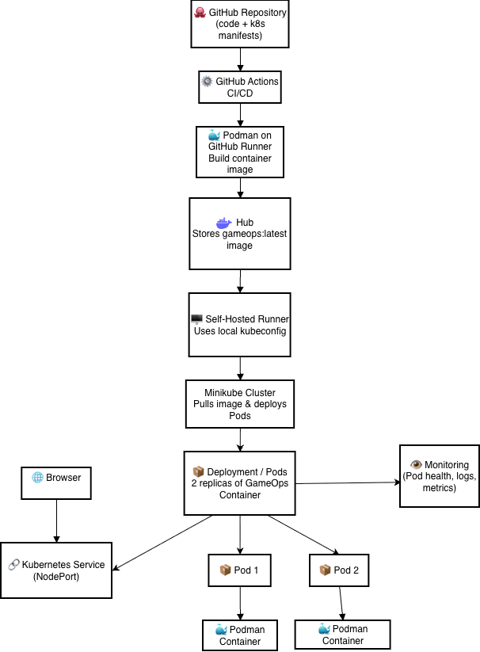
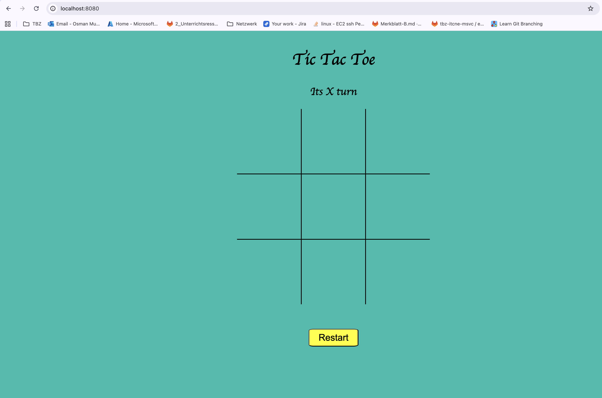
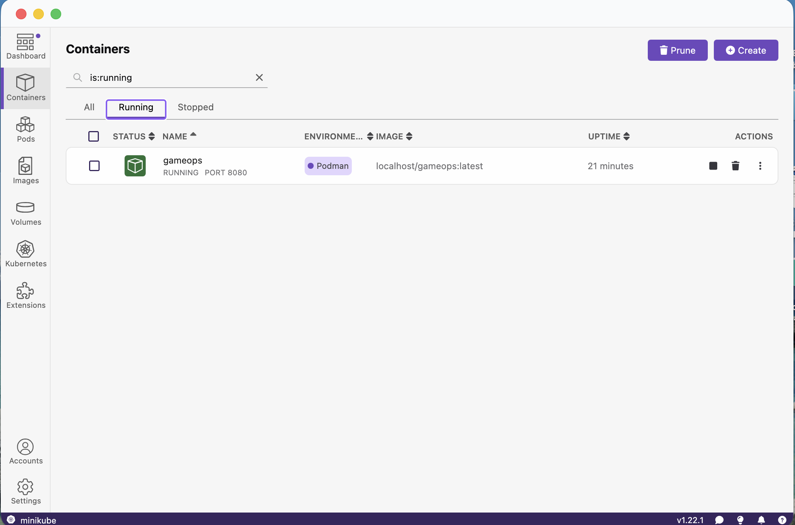

# GameOps
---
## 📉 Projektbeschreibung

Das Tic-Tac-Toe-Spiel wird aktuell lokal entwickelt und läuft nur für einen
Spieler.
Es fehlt die Möglichkeit, die Anwendung so zu gestalten, dass mehrere
Nutzer gleichzeitig spielen können.
Durch die Entwicklung einer skalierbaren Version in Kombination mit
Kubernetes, Containerisierung und CI/CD-Pipelines soll das Spiel
automatisiert bereitgestellt und horizontal skaliert werden, sodass viele
Spieler gleichzeitig eine stabile Spielerfahrung erhalten.

---

## 🎯 Ziele

* **Entwicklung und Containerisierung einer skalierbaren Tic-Tac-Toe-Webanwendung:**

  * Die Anwendung wird mit **HTML, CSS und JavaScript** entwickelt und mithilfe von **Docker bzw. Podman** containerisiert, um eine flexible, portable und reproduzierbare Bereitstellung zu ermöglichen.

* **Aufbau einer CI/CD-Pipeline mit GitHub Actions:**

  * Durch den Einsatz einer automatisierten Pipeline werden **Build-, Test- und Deployment-Prozesse** standardisiert und effizient gestaltet, wodurch manuelle Eingriffe minimiert und die Zuverlässigkeit erhöht werden.

* **Automatisierte Bereitstellung auf lokalem Kubernetes (Minikube):**

  * Die Bereitstellung der Anwendung erfolgt automatisiert über **Kubernetes-Manifeste** auf einer lokalen **Minikube-Umgebung**, um produktionsähnliche Bedingungen für Tests und Entwicklung zu schaffen.

* **Überwachung und Verwaltung mit Lens:**

  * Mithilfe von **Lens** wird die laufende Kubernetes-Umgebung grafisch überwacht, wodurch **Ressourcennutzung, Pod-Zustände und Logs** transparent und einfach nachvollziehbar sind.

* **Sicherstellung einer stabilen Mehrspielernutzung:**

  * Durch die **Skalierbarkeit der Container** und das **Ressourcenmanagement in Kubernetes** wird gewährleistet, dass mehrere Benutzer gleichzeitig spielen können, ohne dass die Performance oder Stabilität der Anwendung beeinträchtigt wird.
---

## 🤖💡💻 Verwendete Technologien

Ich verwende GitHub Actions für CI/CD, um Container mit Podman zu bauen, diese auf Docker Hub zu pushen und anschliessend mithilfe eines self-hosted Runners lokal auf Minikube bereitzustellen. Zur Überwachung des Clusters nutze ich Lens.

### GitHub & CI/CD
Alle Builds und Deployments werden über GitHub Actions automatisiert.
Das Repository enthält sowohl den Frontend-Code als auch die Kubernetes-Manifeste.

```
actions/checkout@v4
azure/setup-kubectl@v3
Runner-Version: 2.329.0
```

### Podman

Podman wird verwendet, um Container-Images zu erstellen und in Docker Hub zu pushen.

```
podman --version
podman version 5.4.0
```

### Docker Hub

Docker Hub dient als Container-Registry, um die erstellten Images zu speichern und für den Minikube-Cluster bereitzustellen.

```
Image: docker.io/<username>/gameops:latest
```

### Minikube & Kubernetes

Minikube wird lokal auf macOS M1 ausgeführt, um ein Kubernetes-Cluster bereitzustellen.
Über **kubectl** werden Deployments und Services angewendet.

```
minikube version
minikube version: v1.37.0
commit: 65318f4cfff9c12cc87ec9eb8f4cdd57b25047f3
```
```
kubectl version --client
Client Version: v1.34.1
Kustomize Version: v5.7.1
```

### Self-Hosted Runner

Der Runner läuft lokal auf macOS ARM64 und führt die Deployments auf Minikube aus.

```
macOS Sonoma 14.0
Architecture: arm64
```

### Lens

Lens wird verwendet, um das Minikube-Cluster visuell zu überwachen (Pods, Deployments, Logs und Services).

```
Lens Desktop 2024.x
```

### Frontend

Das Tic-Tac-Toe-Spiel besteht aus statischen Webdateien, die im Container bereitgestellt werden:

```
index.html
tic-tac-toe.js
tic-tac-toe.css
```

---

## 🛠️ Vorgaben, Methoden und Werkzeuge

### Agile, Kanban
Ich werde **Kanban** verwenden, um alle Aufgaben zu visualisieren und den Status jeder Aufgabe zu verfolgen. Der Status wird dabei in die folgenden Kategorien unterteilt:
- **Noch offen**: Aufgaben, die noch erledigt werden müssen.
- **In Bearbeitung**: Aufgaben, an denen gerade gearbeitet wird.
- **Review**: Aufgaben, die fertiggestellt wurden und überprüft werden müssen. 
- **Erledigt**: Aufgaben, die abgeschlossen sind.

Kanban hilft dabei, die Arbeit transparent und effizient zu organisieren und den Fortschritt kontinuierlich zu überwachen.

---
## 🧱 Architekturübersicht



---
## 🧭 Systemabgrenzung (SEUSAG)
---
## Verzeichnisstruktur

```
📁 GameOps/
├── .github/
│   └── workflows/
│       └── ci‑cd.yml  
├── images/ 
├── k8s/
│   ├── deployment.yaml  
│   └── service.yaml  
├── scripts/
│   └── predeploy‑setup.sh  
├── src/
│   ├── assets/
│   │   ├── css/
│   │   │   └── tic‑tac‑toe.css  
│   │   ├── js/
│   │   │   └── tic‑tac‑toe.js  
│   └── index.html  
├── Containerfile  
└── README.md  
```
---
## 🧑‍💻 Implementierung
---
### Build the Game Frontend UI

Der folgende Abschnitt beschreibt den Aufbau des Frontends für das Tic-Tac-Toe-Spiel.  
Die Benutzeroberfläche besteht aus drei Kernbereichen:

- **HTML** – Struktur & UI-Elemente  
- **CSS** – Layout & Styling  
- **JavaScript** – Spiellogik & Interaktionen  

---
#### HTML – Struktur der Benutzeroberfläche

Die Grundstruktur des Spiels – Spielfeld, Container und UI-Elemente – ist in der index.html definiert.

 **📄 Datei ansehen:**  [➤ index.html öffnen](/src/assets/index.html)

---

#### CSS – Styling & Layout
Das Layout, Farben, Animationen und Responsive Design werden in der CSS-Datei umgesetzt.
Sie definiert unter anderem das Spielfeld, Hover-Effekte und Spieler-Markierungen.

**🎨 CSS-Datei ansehen:**  [➤ tic-tac-toe.css öffnen](/src/assets/css/tic-tac-toe.css)

---

#### JavaScript – Spiellogik & Interaktionen

Die komplette Spielmechanik (Spielzüge, Gewinnlogik, Neustart-Funktion etc.) wird über die JavaScript-Datei gesteuert.
Sie verbindet die UI mit der Spiel-Engine.
**⚙️ JavaScript-Datei ansehen:**  [➤ tic-tac-toe.js öffnen](/src/assets/js/tic-tac-toe.js)

---
### 🕹️ Tic-Tac-Toe Frontend lokal mit Podman ausführen

Dieses Projekt stellt das **Tic-Tac-Toe-Frontend** über einen leichtgewichtigen **Nginx-Container** bereit.  
Mit **Podman** kannst du die Anwendung **lokal, isoliert und portabel** ausführen, ohne dass zusätzliche Webserver oder Entwicklungswerkzeuge auf deinem System installiert sein müssen.

Dieses Setup ist ideal für:

- Schnelles Testen und Entwickeln der Anwendung  
- Präsentationen oder Demos  
- Konsistentes Verhalten auf verschiedenen Rechnern
---
####  📦 Containerfile (Nginx-basierter Webserver)

Das Containerfile erstellt ein schlankes Image auf Basis von `nginx:alpine`.  
Es entfernt die Standard-Nginx-HTML-Dateien und kopiert die eigenen statischen Dateien (HTML, CSS, JS) hinein:

```dockerfile
# Use a lightweight Nginx image
FROM nginx:alpine

# Remove the default Nginx HTML files
RUN rm -rf /usr/share/nginx/html/*

# Copy your static files into Nginx
COPY src/assets/index.html /usr/share/nginx/html/
COPY src/assets/css/tic-tac-toe.css /usr/share/nginx/html/
COPY src/assets/js/tic-tac-toe.js /usr/share/nginx/html/ 

# Expose port 80
EXPOSE 80

# Start Nginx
CMD ["nginx", "-g", "daemon off;"]
```

##### 🔹 Erklärung der einzelnen Schritte

FROM nginx:alpine – Nutzt ein leichtes, stabiles Nginx-Image als Basis.

RUN rm -rf /usr/share/nginx/html/ – Entfernt die Standard-Nginx-Seite.

COPY … – Kopiert HTML, CSS und JS ins Nginx-Webverzeichnis.

EXPOSE 80 – Öffnet den Standard-HTTP-Port im Container.

CMD ["nginx", "-g", "daemon off;"] – Startet Nginx im Vordergrund, damit der Container aktiv bleibt.

---

##### 🛠️ Image bauen

Baue das lokale Image:

```
podman build -t gameops .
```
- Das Image heisst gameops
- Enthält alle Frontend-Dateien und einen Nginx-Webserver
---

##### ▶️ Container starten

Starte den Container und mappe den Container-Port 80 auf Host-Port 8080:

```
podman run -d -p 8080:80 --name gameops-ui gameops
```
- -d → Container läuft im Hintergrund

- -p 8080:80 → Host-Port 8080 auf Container-Port 80
- --name gameops-ui → Name des laufenden Containers

---
##### 🌐 Anwendung öffnen

Öffne deinen Browser: 

```
http://localhost:8080
```
Du solltest nun das Tic-Tac-Toe-Frontend sehen und direkt spielen können.



---
##### 📊 Containerstatus prüfen

Um zu prüfen, ob der Container läuft:

```
podman ps
```
| Container  | Status  | Port | Image   |
| ---------- | ------- | ---- | ------- |
| gameops-ui | RUNNING | 8080 | gameops |

###### In der Podman-App
- Öffne die Podman Desktop-App.  
- Unter **Container** siehst du alle laufenden Container, deren **Status**, **Name** und **zugeordnete Ports**.  
- So kannst du schnell prüfen, ob der Tic-Tac-Toe-Container aktiv ist.
  


---
---
---
## ✅ Sprint Review
---
### Sprint 0
---
#### Zeitraum

<table>
  <thead>
    <tr>
      <th style="background-color:#f2f2f2;">Period</th>
      <th style="background-color:#f2f2f2;">Task</th>
    </tr>
  </thead>
  <tbody>
    <tr>
      <td style="color:#2E86C1;">01.11.2025 – 10.11.2025</td>
      <td style="color:#117A65;">Project Setup</td>
    </tr>
  </tbody>
</table>

---
#### Sprintziel

**Project Setup:**
Das Projekt initialisieren, die technische Basisstruktur festlegen und die notwendigen Repositories, Tools und Workflows zur Zusammenarbeit im Team aufsetzen.

---
#### 🛠️ User Stories – Project Setup
---


---
##### 🟣 User Story 1: GitHub-Repository einrichten <a name="user-story-1"></a>
**Als** Entwickler  
**möchte ich** ein GitHub-Repository erstellen,  
**damit** wir den Code versionieren und gemeinsam bearbeiten können.

**Akzeptanzkriterien:**
- Ein Repository mit dem Namen GameOps ist unter der richtigen Organisation oder dem richtigen Account vorhanden.
- Eine README.md, .gitignore und eine passende Lizenzdatei sind erstellt.
- Zugriffsrechte und Branch-Protection-Regeln sind korrekt konfiguriert.
---

##### 🟣 User Story 2: Verzeichnisstruktur organisieren <a name="user-story-2"></a>
**Als** Entwickler  
**möchte ich** Die Repository-Struktur wird klar und einheitlich aufgebaut, um die Wartbarkeit und Übersichtlichkeit zu gewährleisten.  
**damit** eine gemeinsame technische Grundlage besteht.

**Benötigte Verzeichnisse:**
- app/ – Applikationsquellcode
- deployment/ – Deployment-Skripte und -Konfigurationen
- .github/workflows/ – CI/CD-Workflows und Automatisierungen
- docs/ – Projektdokumentation

**Akzeptanzkriterien:**
- Die oben genannten Ordner sind im Repository vorhanden.

---

 ##### 🟣 User Story 3: Lokale Entwicklungs-Tools installieren und konfigurieren <a name="user-story-3"></a>

**Als** Entwickler  
**möchte ich** Entwicklung notwendigen Tools installieren
**damit** wir unsere Infrastruktur aufbauen können.

**Tools**

- **Docker** – Zum Containerisieren und lokalen Ausführen der Applikation

- **Minikube** – Zum Simulieren einer Kubernetes-Umgebung

- **Lens** – Zur Verwaltung und Visualisierung von Kubernetes-Ressourcen

**Akzeptanzkriterien:**
- Docker, Minikube und Lens sind lokal installiert und funktionsfähig.
- Die Grundfunktionen jedes Tools (z. B. Start eines Testcontainers oder lokalen Clusters) wurden erfolgreich überprüft.
---
#### Sprint Backlog


| Nr. | Bereich            | User Story                                           | Status   |
|-----|--------------------|------------------------------------------------------|----------|
| 1   | Project Setup      | [GitHub-Repository einrichten einrichten](#user-story-1)       | ✅ Done  |
| 2   | Project Setup      | [Verzeichnisstruktur organisieren definieren](#user-story-2)          | ✅ Done  |
| 3   | Project Setup      | [Lokale Entwicklungs-Tools installieren und konfigurieren](#user-story-3)                               | ✅ Done  |

---
#### 🏁 Sprint Review
---
##### ✅ Was wurde erreicht?
- Neues **GitHub-Repository `GameOps`** wurde erfolgreich erstellt und konfiguriert.  
- Klare **Projektstruktur** mit den Verzeichnissen `app/`, `deployment/`, `.github/workflows/` und `docs/` wurde angelegt.  
- **README.md**, `.gitignore` und Lizenzdatei wurden hinzugefügt.  
- **Docker**, **Minikube** und **Lens** wurden lokal installiert und erfolgreich getestet.  
- Grundlegende **CI/CD-Struktur** vorbereitet (Workflows-Ordner vorhanden).  
---
##### ⚠️ Herausforderungen
- Lokale Installation von **Minikube** benötigte zusätzliche Anpassungen an der Umgebung.  
- Erste **Repository-Zugriffsrechte** mussten nachträglich korrigiert werden.  
- Zeitplanung für das lokale Setup wurde leicht unterschätzt.  
---
##### 🎓 Lessons Learned
- Frühzeitige Planung der lokalen Entwicklungsumgebung spart viel Abstimmungsaufwand.  
- Zugriffs- und Berechtigungsstrukturen sollten vor dem Start klar definiert sein.  
- Gemeinsame Dokumentation im `docs/`-Ordner erleichtert zukünftige Einarbeitungen.  
---

#### 🔍 Sprint Retrospective
---
##### ✅ Was lief gut?
- Das **Repository** wurde sauber erstellt und ist klar strukturiert.  
- Die Teammitglieder konnten **Docker**, **Minikube** und **Lens** erfolgreich einrichten.  
- Zusammenarbeit im Team war effizient und gut koordiniert.  
- Dokumentation wurde parallel gepflegt.  
---
##### ⚠️ Was lief nicht gut?
- Die Installation von **Minikube** war auf einigen Geräten fehleranfällig.  
- Zugriffsrechte auf das GitHub-Repository mussten manuell nachjustiert werden.  
- Die Zeit für lokale Tests wurde etwas unterschätzt.  
---
##### 🚀 Verbesserungsmöglichkeiten
- Künftige lokale Setups sollten durch eine **standardisierte Installationsanleitung** unterstützt werden.  
- **Repository-Berechtigungen** direkt zu Sprintbeginn festlegen.  
- Einen **kurzen Testlauf der Tool-Installation** im Voraus einplanen, um mögliche Fehlerquellen früh zu erkennen.  
  
---
### Sprint 1
---
#### Zeitraum

<table>
  <thead>
    <tr>
      <th style="background-color:#f2f2f2;">Period</th>
      <th style="background-color:#f2f2f2;">Sprint</th>
    </tr>
  </thead>
  <tbody>
    <tr>
      <td style="color:#2E86C1;">10.11.2025 – 17.11.2025</td>
      <td style="color:#117A65;">Game Frontend Development and Containerization</td>
    </tr>
  </tbody>
</table>

---
#### Sprintziel
**Game Frontend Containerization:** Entwicklung und Containerisierung des Tic-Tac-Toe Frontends. Fokus liegt auf dem Aufbau einer klar strukturierten Projektverzeichnisstruktur, der Erstellung des Frontend-UI-Codes (HTML, CSS, JS), der Containerisierung mit Docker (Containerfile) sowie dem Testen des Containers lokal, um eine stabile Basis für zukünftiges Deployment auf Kubernetes zu schaffen.

---
#### 🖥️📦 User Stories - Game Frontend Development & Containerization
---


---

##### 🟣 **User Story 4: Game Frontend UI entwickeln** <a name="user-story-4"></a>  
**Als** Entwickler  
**möchte ich** die Benutzeroberfläche des Spiels entwickeln  
**damit** die Spieler eine funktionale und ansprechende UI zum Spielen haben.

**Akzeptanzkriterien:**  
- HTML, CSS und JS für das Tic-Tac-Toe-Frontend sind geschrieben.  
- Die UI kann lokal im Browser getestet werden und reagiert korrekt auf Spielerinteraktionen.  
- Grundlegende Layout- und Designrichtlinien sind umgesetzt.

---

##### 🟣 **User Story 5: Entwicklungsumgebung und Projektstruktur aufsetzen** <a name="user-story-5"></a>  
**Als** Entwickler  
**möchte ich** die Projektstruktur klar organisieren  
**damit** die Wartbarkeit und Erweiterbarkeit des Frontends gewährleistet ist.

**Benötigte Verzeichnisse:**  
- `.github/workflows/` – CI/CD-Workflows  
- `src/assets/` – HTML, CSS, JS  
- `images/` – Dokumentation bilder  
- `k8s/` – Kubernetes-Deployment- und Service-Dateien  
- `scripts/` – Hilfsskripte für Setup oder Deployment  
- `Containerfile` – Dockerfile für das Frontend  
- `README.md` – Projektdokumentation

**Akzeptanzkriterien:**  
- Ordnerstruktur ist erstellt und sauber dokumentiert.  
- Teammitglieder können die Dateien problemlos finden und erweitern.

---

##### 🟣 **User Story 6: Frontend mit Docker containerisieren** <a name="user-story-6"></a>  
**Als** Entwickler  
**möchte ich** das Frontend in einem Docker-Container laufen lassen  
**damit** wir es konsistent lokal und später in Kubernetes ausführen können.

**Dockerfile** (bereits geschrieben):

```
# Use a lightweight Nginx image
FROM nginx:alpine

# Remove the default Nginx HTML files
RUN rm -rf /usr/share/nginx/html/*

# Copy your static files into Nginx
COPY src/assets/index.html /usr/share/nginx/html/
COPY src/assets/css/tic-tac-toe.css /usr/share/nginx/html/
COPY src/assets/js/tic-tac-toe.js /usr/share/nginx/html/

# Expose port 80
EXPOSE 80

# Start Nginx
CMD ["nginx", "-g", "daemon off;"]
```
---
##### 🟣 User Story 7: Test Frontend Container Locally <a name="user-story-7"></a>
**Als** Entwickler  
**möchte ich** den Frontend-Container lokal starten und testen,  
**damit** sichergestellt ist, dass die Applikation korrekt läuft und alle Dateien richtig eingebunden sind.

**Akzeptanzkriterien:**
- Der Container kann lokal gestartet werden (z. B. `podman start`).  
- Die HTML-, CSS- und JS-Dateien werden korrekt geladen und die UI funktioniert erwartungsgemäss.  
- Der Container lauscht auf dem vorgesehenen Port (z. B. 80) und ist über den Browser erreichbar.  
- Eventuelle Fehler im Container oder Pfadprobleme werden erkannt und behoben.  
---
#### Sprint Backlog

| Nr. | Bereich            | User Story                                           | Status   |
|-----|--------------------|------------------------------------------------------|----------|
| 4   |  Frontend Dev | [Game Frontend UI entwickeln](#user-story-4)                  | ✅ Done  |
| 5   | Project Setup | [Entwicklungsumgebung & Projektstruktur aufsetzen](#user-story-5)      | ✅ Done  |
| 6   | Containerization | [Frontend mit Docker containerisieren](#user-story-6)    | ✅ Done  |
| 7   | Containerization | [Frontend Container lokal testen](#user-story-7)    | ✅ Done  |
---
#### 🏁 Sprint Review
---

##### ✅ Was wurde erreicht?
- Frontend UI für Tic-Tac-Toe wurde erfolgreich entwickelt.  
- Projektstruktur mit `.github/workflows/`, `src/assets/`, `images/`, `k8s/` und `scripts/` ist aufgebaut.  
- Dockerfile (Containerfile) für das Frontend erstellt und Container lokal getestet.  
- Frontend-Container läuft fehlerfrei auf Port 80.  
---
##### ⚠️ Herausforderungen
- Erste Abstimmung zur Projektstruktur benötigte etwas Zeit.  
- Pfade im Containerfile mussten mehrfach angepasst werden, um alle Dateien korrekt zu kopieren.  
- Lokaler Containerstart war auf einigen Systemen zunächst fehleranfällig (z. B. Port-Konflikte).  
---
##### 🎓 Lessons Learned
- Saubere Projektstruktur erleichtert die spätere Weiterentwicklung und Containerisierung.  
- Containerfile frühzeitig testen, um Build- und Laufzeitprobleme zu vermeiden.  
- Dokumentation von Pfaden und Container-Ports spart Zeit bei Teamtests.  
---
#### 🔍 Sprint Retrospektive
---

##### ✅ Was lief gut?
- Frontend-Code wurde termingerecht fertiggestellt.  
- Containerfile funktionierte nach einigen Anpassungen problemlos.  
- Team konnte schnell lokal mit dem Container arbeiten.  
- Dokumentation der Projektstruktur wurde parallel gepflegt.  
---
##### ⚠️ Was lief nicht gut?
- Lokaler Containerstart war teilweise fehleranfällig.  
- Abstimmung bei Verzeichnisstruktur und Containerfile erforderte Nachbesserungen.  
---
##### 🚀 Verbesserungsmöglichkeiten
- Standardisierte Vorlage für Containerfile und Projektstruktur einführen.  
- Portkonflikte frühzeitig prüfen und dokumentieren.  
- Testcontainer auf mehreren Systemen validieren, bevor der Sprint endet.
---